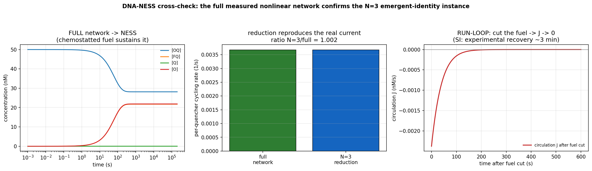
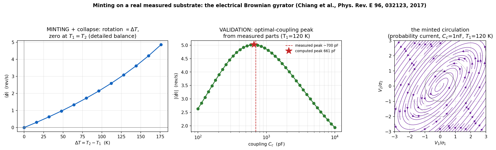
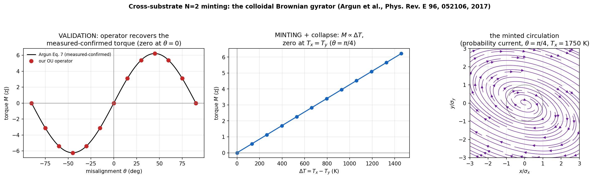
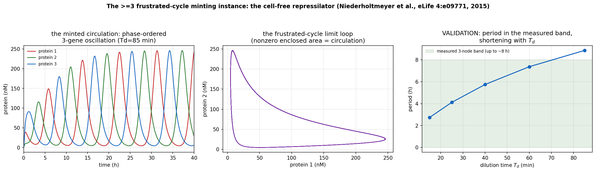

# Character

*A framework that reads driven steady states — across physics, chemistry, biology, and computation — as one structure on a single axis. Every result is borrowed; the only claim is the reading; one experiment can falsify it.*

[](LICENSE)

## Overview

**Character** is a theoretical framework for **driven steady states** — systems held away from equilibrium by a continuous throughput of energy (a laser above threshold, a metabolizing cell, a fuel-fed chemical loop, an error-correcting code). It introduces no new machinery: every component is imported from an established field — laser-threshold physics, stochastic thermodynamics, signed-graph frustration, queueing theory, the topology of error-correcting codes — and named to its source in [`character_prior_art.md`](framework/character_prior_art.md). The only claim is the **reading**: that these are the same structure in different settings, stated as a measurement that can fail.

A steady state is read as two independent bits:

- a **soft** bit — *how much* (brightness, concentration, amplitude): continuously tunable, erasable for the cost of one bit;
- a **hard** bit — *which way it turns* (a protected circulation locked on a frustrated cycle): changeable only by rewiring.

A single control parameter `a = ln(gain / loss)` sets the regime — robust at high `a`, critical (slow, aging, remembering) near zero, relaxed to equilibrium below — and coincides exactly with four quantities from four fields: entropy produced per step, pump above lasing threshold, population branching ratio, and a log-likelihood ratio.

The framework's central mechanism is **minting**: coupling two unprotected systems around a cycle can produce a protected circulation present in neither part alone, sustained only while driven. Full exposition, with every derivation and falsifier, is in [`framework/character.md`](framework/character.md).

## Real-substrate instances

Minting is instanced on four real, measured systems across four fields. Each operator is built from the named system's own published parameters and reproduces that system's measured signature; the figures are the output of running the code in [`experiments/`](experiments/), not illustrations.

| Substrate | Field | Structure | Operator reproduces |
|---|---|---|---|
| DNA reaction network — [Nicholas et al. 2025](https://doi.org/10.1002/anie.202512967) | chemistry | ≥3 cycle | minted NESS circulation; collapse ~3 min after fuel-cut |
| Electronic Brownian gyrator — [Chiang et al. 2017](https://doi.org/10.1103/PhysRevE.96.032123) | electronics | N=2 | measured optimal-coupling rotation peak |
| Colloidal Brownian gyrator — [Argun et al. 2017](https://doi.org/10.1103/PhysRevE.96.052106) | fluidics | N=2 | measured-confirmed torque, to 3×10⁻¹⁶ |
| Cell-free repressilator — [Niederholtmeyer et al. 2015](https://doi.org/10.7554/eLife.09771) | synthetic biology | ≥3 cycle | measured oscillation-period band |



*Chemistry, ≥3 cycle — the balanced reversible core; the enzyme fuel-drain mints a NESS circulation (reproduced by an N=3 reduction, center) that collapses ~3 min after fuel-cut (right).*



*Electronics, N=2 — the Fokker–Planck operator from the measured RC parts reproduces the measured optimal-coupling rotation peak.*



*Fluidics, N=2 — the same method, from raw optics and fluidics, recovers the measured-confirmed torque to relative error 3×10⁻¹⁶.*



*Synthetic biology, ≥3 cycle — the frustrated gene ring mints a phase-ordered oscillation; the period from the measured biochemistry lands in the measured band and shortens with dilution.*

## Documentation

The framework and its supporting material live in [`framework/`](framework/):

| File | Contents |
|---|---|
| [`character.md`](framework/character.md) | the framework: the point, the manifold `ℭ`, the closure `⊗` |
| [`character_prior_art.md`](framework/character_prior_art.md) | every imported result, named to its source |
| [`character_receipts.md`](framework/character_receipts.md) | the derivation and falsifier behind each claim |
| [`character_frontier.md`](framework/character_frontier.md) | the maturity ledger: what is settled, what would move it |
| [`character_substrate_ledger.md`](framework/character_substrate_ledger.md) | every substrate tested, with its verdict |
| [`character_substrate_method.md`](framework/character_substrate_method.md) | how a viable real-data substrate is found |
| [`character_grounding_method.md`](framework/character_grounding_method.md) · [`character_fdr_treatment.md`](framework/character_fdr_treatment.md) · [`character_translation_method.md`](framework/character_translation_method.md) | grounding method and depth treatments |

## Experiments

The scripts in [`experiments/`](experiments/) build each operator and run the protocol, printing a verdict and writing a figure. They require only Python 3 with NumPy, SciPy, and Matplotlib:

```bash
pip install numpy scipy matplotlib
python experiments/repressilator_minting.py          # ≥3 frustrated-cycle instance (gene oscillator)
python experiments/repressilator_crosscheck.py       # its independent FFT + Hopf cross-check
python experiments/gyrator_minting.py                # electronic gyrator (N=2)
python experiments/colloidal_gyrator_crosscheck.py   # colloidal gyrator (N=2)
```

Alongside the four real-substrate operators are direct simulations on synthetic substrates: the branch-survival barrier, the cycle affinity, and the two-survivals plane with all four corners instanced.

## Status

The reading is supported across four real substrates and a set of exactly-solvable synthetic ones, but its sharpest test is unrun: a single memory exponent `β` is required to govern three independent measurements at once — correlation aging, waiting-time tails, and the memory kernel. These have not been measured together on one substrate. If they fail to collapse onto one number, the reading is wrong.

## License

[CC-BY-4.0](LICENSE). The legacy corpus is frozen in [`mpa-atlas`](https://github.com/ronviers/mpa-atlas) (snapshot `character-v0.1`); all `mpa-*` repos are legacy.
